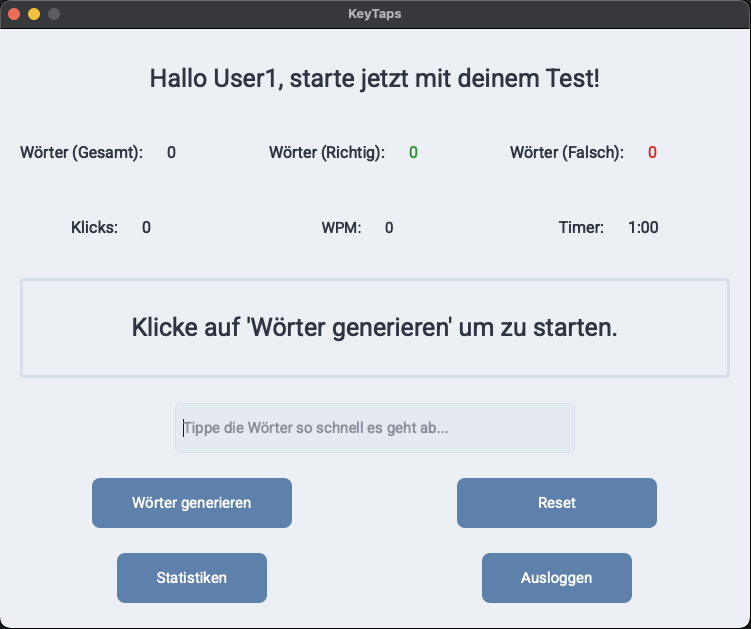

# ⌨️ Typing Speed Test – Dein Tippgefühl im Check!

Ein moderner, intuitiver Tippgeschwindigkeitstest mit PyQt6 – ideal, um deine Schreibgeschwindigkeit zu messen, Fehler zu analysieren und Fortschritte visuell zu verfolgen.  
Ob zum Trainieren, Vergleichen oder einfach aus Spaß – hier kommt dein neues Lieblings-Tipptool!

---

## ✨ Features

- 🖥 **Benutzerfreundliche Oberfläche** mit modernem UI-Design
- 🔠 **Wörter zufällig generiert** aus einer umfangreichen, durchdachten Liste
- ⌨️ **Live-Eingabeanalyse** (grün = korrekt, rot = falsch)
- ⏱ **60-Sekunden Countdown** mit automatischem Testende
- 📊 **Echtzeit-Anzeige** von:
  - WPM (Wörter pro Minute)
  - KPM (Tastenanschläge pro Minute)
  - Richtige/Falsche Wörter
- 📈 **Resultat-Dialog nach jedem Run** mit Statistiken
- 💾 **Highscore-Speicherung (CSV)** – optional, bei ≥ 75 % korrekter Eingaben
- 👤 **Profilwahl**ß
- 🎯 **Ziel: besser werden, nicht nur schneller tippen**

---

## 📷 Vorschau

---